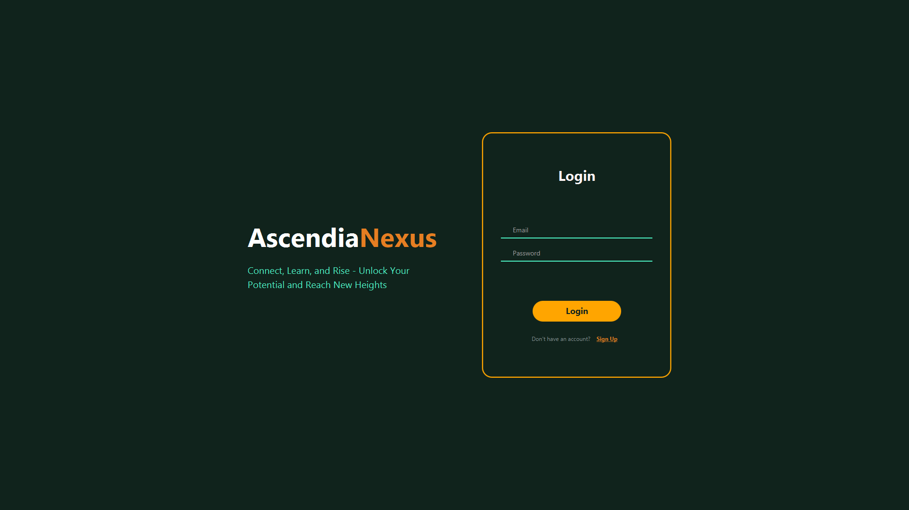
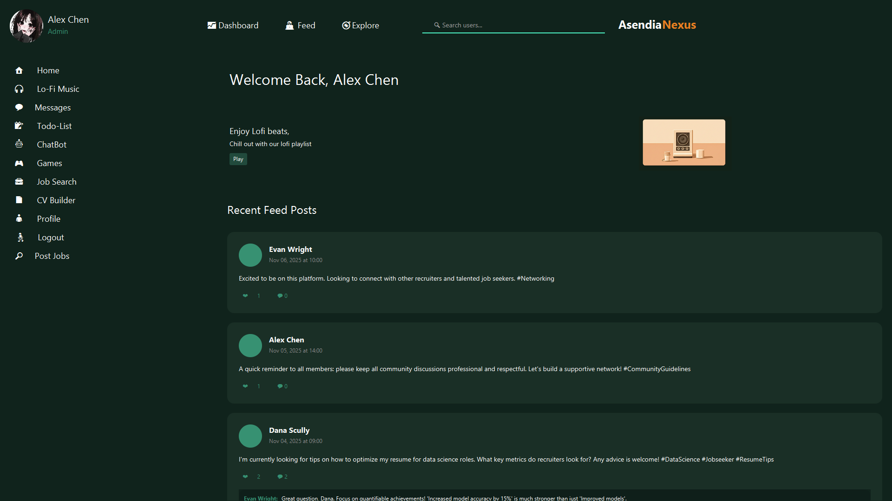
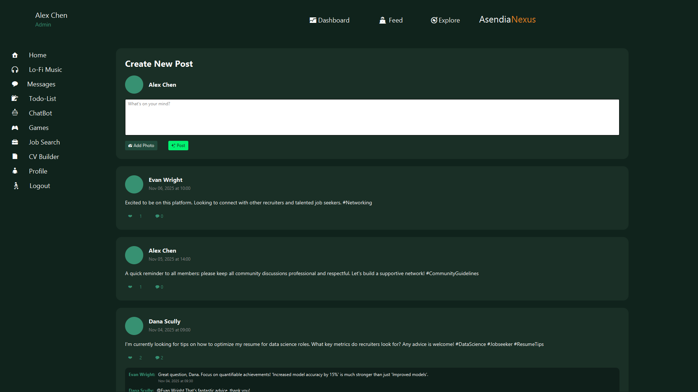
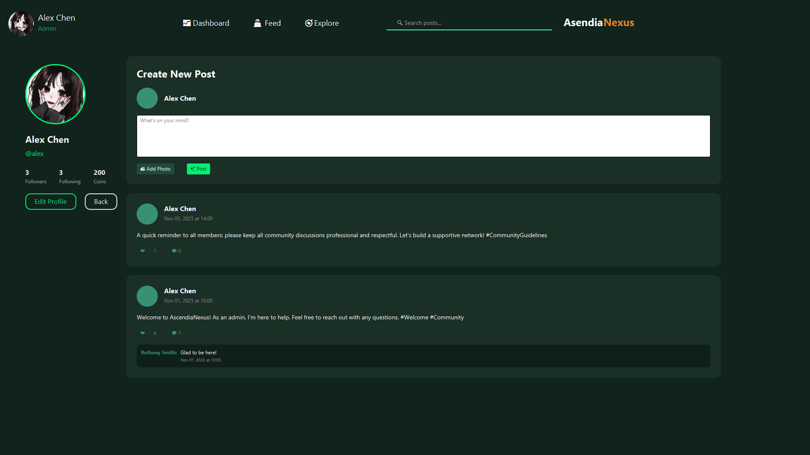
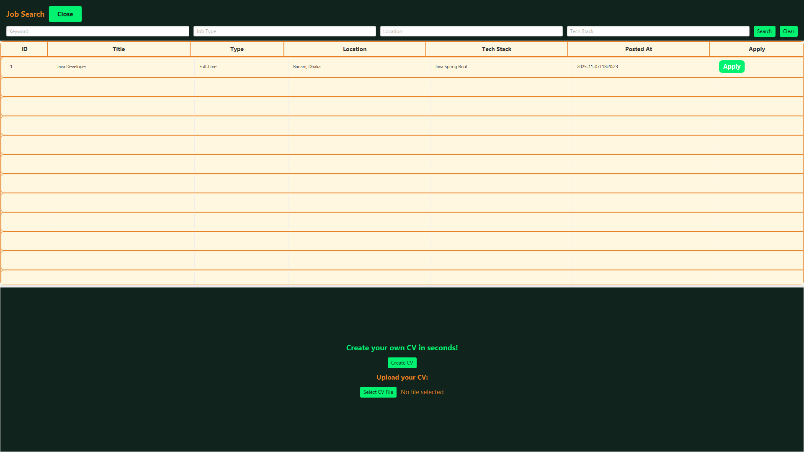
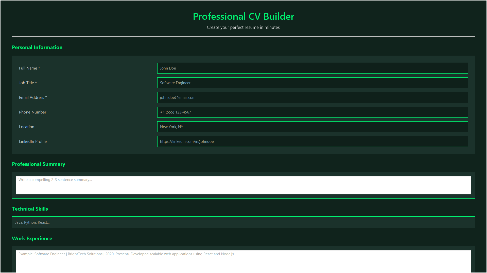
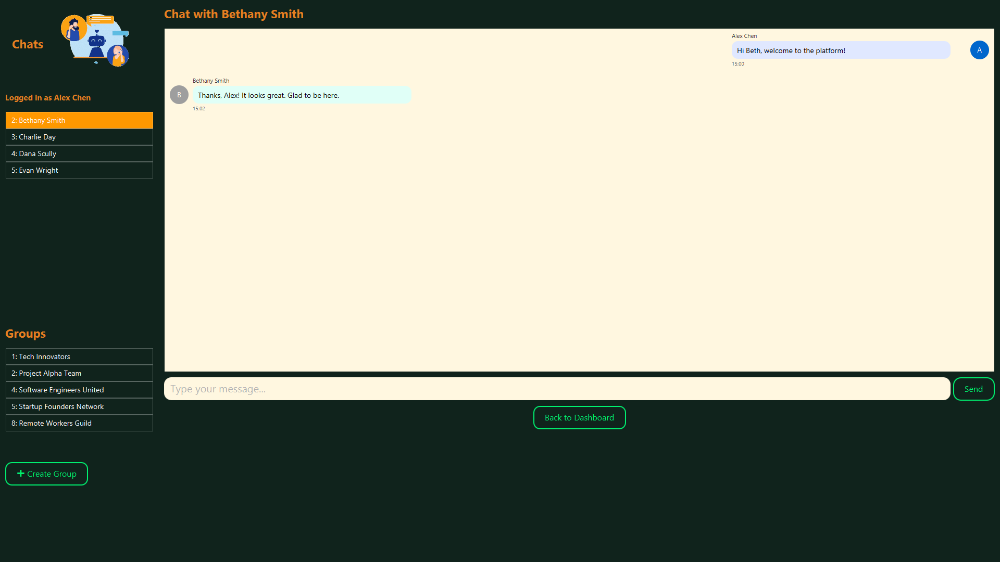
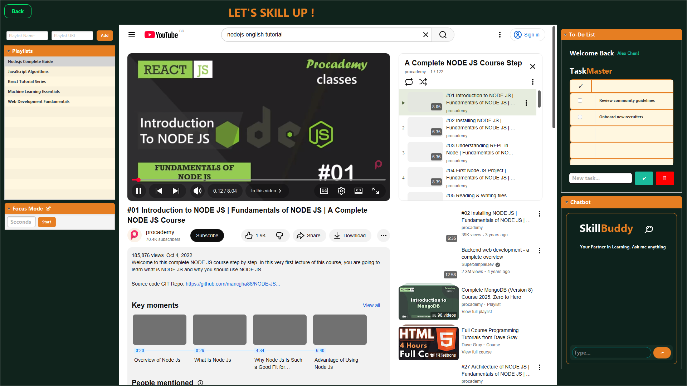

# AscendiaNexus


**A multi-functional desktop application built with JavaFX, combining a professional network, job portal, and social community all in one.**

This project was developed for our "Advanced Object-Oriented Programming" (AOOP) university course.

---

## 🏆 Achievement 🏆

**Alhamdulillah, this project was awarded 1st Place at the CSE Project Show at UIU.** It was selected as the winner from a field of 115 teams. We are proud of what we built and the comprehensive, real-world features we were able to implement.

---

## 📺 Project Showcase

Here is a complete video overview of all major features, from the social feed and job portal to the AI chatbot and CV builder.

[](https://www.youtube.com/watch?v=yB9FQN9r-sA)

---

## ✨ Key Features

AscendiaNexus is a complete ecosystem with three distinct user roles (Job Seeker, Recruiter, and Admin) and a rich set of features:

* **🌐 Full Social Feed:** Create posts, like, and comment on a live feed. Admins have full moderation privileges to delete any post.
* **🧑‍💼 User Profiles:** Search for any user, view their profile and posts, and follow/unfollow them.
* **✍️ CV Builder:** A built-in tool to fill out your professional details and generate a clean, formatted PDF resume.
* **🚀 Job Portal:**
    * **Job Seekers:** Can search and filter for jobs posted on the platform.
    * **Recruiters:** Can post new jobs, manage their listings, and view all applicants for a position.
    * **Admins:** Can view and moderate all jobs from all recruiters.
* **💬 Real-time Chat:** A socket-based chat server allows for both one-on-one and group messaging between users.
* **🤖 "Skill Buddy" AI Chatbot:** An integrated AI assistant (powered by the Open Router API) to answer questions and provide help.
* **🎓 Explore & Focus Mode:** A dedicated learning section with embedded YouTube playlists. It includes a "Focus Mode" timer that locks the user in to prevent distractions.
* **🎮 Game Center:** A relaxation zone with three built-in games: Flappy Bird, Bubble Shooter, and classic Chess.
* **🎵 Lo-Fi Music Player:** A persistent music player that can run in the background while you navigate the app.
* **✅ "TaskMaster" To-Do List:** A personal to-do list to keep track of your tasks, fully integrated with the database.

---

## 📸 Screenshots

| Login & Sign-Up | Main Dashboard |
| :---: | :---: |
|  |  |

| Full Social Feed | User Profile |
| :---: | :---: |
|  |  |

| Job Search | CV Builder |
| :---: | :---: |
|  |  |

| Real-time Chat | Explore & Learn |
| :---: | :---: |
|  |  |

---

## 🛠️ Tech Stack

* **Frontend:** JavaFX, FXML, CSS
* **Backend:** Java (JDK 23)
* **Database:** MySQL
* **Libraries & APIs:**
    * **Java Sockets** (for Real-time Chat)
    * **Open Router API** (for the AI Chatbot)
    * **Apache PDFBox** (for CV Generation)
    * **JavaFX Media & Web** (for Music & YouTube)

---

## 🚀 How to Run

This project is ready to run with minimal setup.

### 1. Prerequisites
* Java JDK 23 or higher
* An IDE (like IntelliJ IDEA or VSCode)
* MySQL Server (e.g., via XAMPP)

### 2. Database Setup
1.  Open phpMyAdmin and create a new database named `java_user_database`.
2.  Import the `ascendia_nexus_demo_data.sql` file (located in the root of this repository) into your new database. This will set up all the necessary tables and demo users.
3.  **Important:** This project was built using MySQL on port `4306`. If your MySQL server runs on a different port (like the default `3306`), you must **either**:
    * Change your MySQL port to `4306`.
    * **OR** go into the code and update the connection string in all `dao` files (e.g., `PostDAO.java`, `DBUtils.java`, etc.) to use your port.

### 3. Environment Variable
The "Skill Buddy" AI Chatbot requires an API key from [Open Router](https://openrouter.ai/).

1.  Get your free API key from Open Router.
2.  Set it as an environment variable on your computer named `OPENROUTER_API_KEY`.
    * (The application will still run without this, but the chatbot will show an error.)

### 4. Run the Application
1.  Clone this repository:
    ```bash
    git clone https://github.com/rumman999/AOOP-Project-AscendiaNexus.git
    ```
2.  Open the project in your IDE and let Maven download the dependencies.
3.  Run the main application file:
    `src/main/java/com/example/aoop_project/AscendiaNexusApp.java`

That's it! The application will launch, and the `ChatServer` will start automatically in the background.

**Demo Accounts:**
| Role | Email | Password |
| :--- | :--- | :--- |
| **Admin** | `alex@email.com` | `Alex@123` |
| **Recruiter** | `beth@email.com` | `Beth@123` |
| **Jobseeker** | `charlie@email.com` | `Charlie@123` |

---

## ⚠️ Important Disclaimers

### A Note on This Version
This repository represents our final university submission. As with many ambitious student projects, the final push involved merging features from multiple team members working on different laptops. Due to this rapid integration under a tight deadline, some features may be less stable than intended. It stands as a proud snapshot of our intensive learning, teamwork, and development process!

### Our Approach to AI Assistance
As students of technology, we believe in using all tools available. We strategically leveraged generative AI as a modern development tool to enhance our productivity and solve complex problems. AI was used for brainstorming, debugging challenging errors (like JavaFX pathing issues or complex SQL), and exploring new APIs. It served as a pair-programming assistant, not as a replacement for our core logic, architecture, or the creative vision for this project.

---

## 👨‍💻 Meet the Team (Team Ascendia)

* **[Rumman Karim](https://github.com/rumman999)**
* **[Torongo E. Rozario](https://github.com/Torongo-CS)**
* **[Samiur Rahman Sameer](https://github.com/Sameer-r35)**

---

## 📄 License
This project is licensed under the MIT License - see the [LICENSE](LICENSE) file for details.